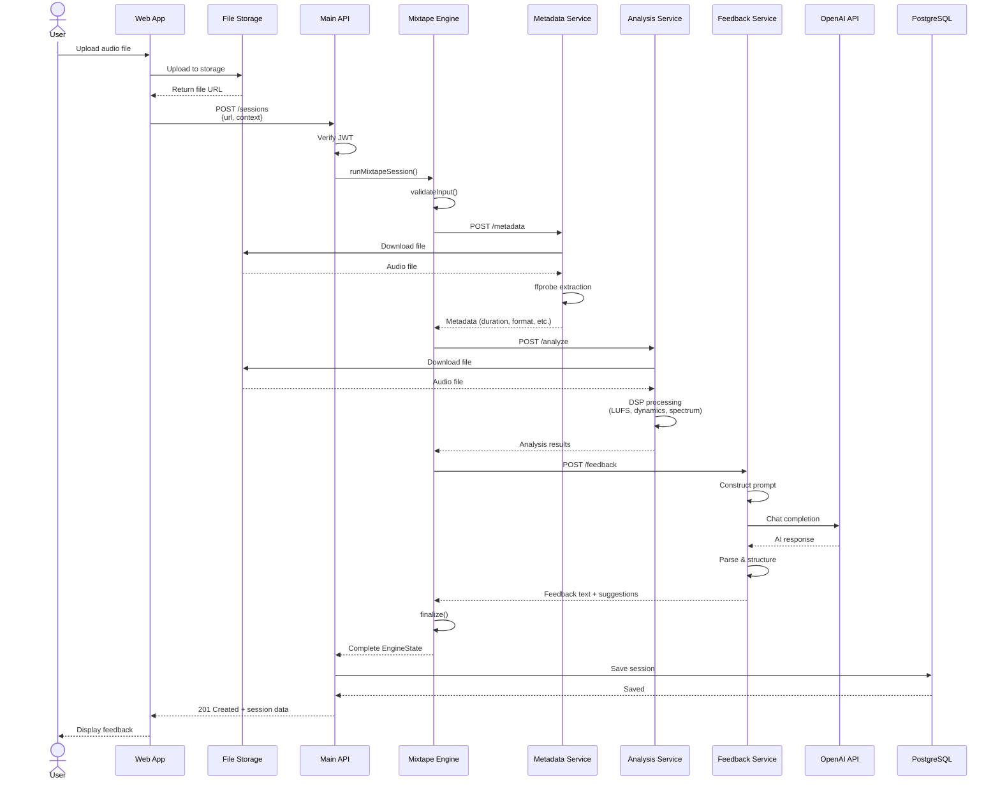

# Session Lifecycle

This guide walks through the complete lifecycle of an Mixtape session, from audio upload to feedback delivery.

## Overview

An Mixtape session represents a single audio file's journey through metadata extraction, DSP analysis, and AI-powered feedback generation. The entire lifecycle typically takes 10-60 seconds, depending on file duration and service load.

## Lifecycle Diagram



## Phase-by-Phase Breakdown

### Phase 1: File Upload

**Trigger:** User selects audio file in web app

**Steps:**
1. Web app requests presigned upload URL from API
2. User's browser uploads file directly to CDN/S3
3. CDN returns permanent file URL
4. Web app stores URL for session creation

**Duration:** 2-30 seconds (depends on file size and network)

**Error Scenarios:**
- File too large (>100MB): Rejected before upload
- Network failure: User retries upload
- Invalid file type: Rejected by CDN

::: tip Direct Upload
Uploading directly to CDN (rather than through the API) reduces server load and improves performance. The API only handles the URL, not the file bytes.
:::

### Phase 2: Session Initialization

**Trigger:** User clicks "Analyze" button

**Request:**
```http
POST /api/sessions HTTP/1.1
Cookie: mixtapelabs_token=<jwt>
Content-Type: application/json

{
  "uploadUrl": "https://cdn.example.com/uploads/mix.wav",
  "userContext": {
    "daw": "Ableton Live",
    "genre": "trap",
    "experienceLevel": "intermediate"
  }
}
```

**API Processing:**
1. Auth middleware extracts and verifies JWT
2. Controller extracts user ID from JWT claims
3. Controller generates unique session ID (UUID)
4. Controller builds engine dependencies (HTTP clients)
5. Controller invokes `runMixtapeSession()`

**Duration:** <100ms (before workflow starts)

**Error Scenarios:**
- Invalid JWT: 401 Unauthorized
- Missing required fields: 400 Bad Request
- Engine dependency error: 500 Internal Server Error

### Phase 3: Input Validation

**Node:** `validateInput`

**Checks:**
- Session ID is valid UUID
- Upload URL is valid HTTPS URL
- User context fields are present

**Duration:** <10ms

**Error Scenarios:**
- Invalid session ID format: Throws error, workflow terminates
- Invalid URL: Throws error, workflow terminates

::: warning Fail Fast
Input validation happens before any expensive operations (API calls, file downloads). This saves time and resources by catching issues early.
:::

### Phase 4: Metadata Extraction

**Node:** `fetchMetadata`

**Request to Metadata Service:**
```http
POST /metadata HTTP/1.1
x-api-key: <key>
Content-Type: application/json

{
  "url": "https://cdn.example.com/uploads/mix.wav"
}
```

**Service Processing:**
1. Download file from CDN (streaming, not fully buffered)
2. Execute `ffprobe` on file
3. Parse JSON output
4. Return structured metadata

**Response:**
```json
{
  "durationSec": 210.5,
  "format": "wav",
  "sampleRate": 48000,
  "channels": 2,
  "bitrate": 1536000
}
```

**State Update:**
```typescript
state.fileInfo = {
  durationSec: 210.5,
  format: 'wav',
  sampleRate: 48000,
  channels: 2,
  bitrate: 1536000
};
```

**Duration:** 1-3 seconds

**Error Scenarios:**
- File not found (404): Throws error, workflow terminates
- Invalid audio file: ffprobe fails, error returned
- Service timeout: Throws error after 30 seconds

### Phase 5: Audio Analysis

**Node:** `analyze`

**Request to Analysis Service:**
```http
POST /analyze HTTP/1.1
x-api-key: <key>
Content-Type: application/json

{
  "url": "https://cdn.example.com/uploads/mix.wav"
}
```

**Service Processing:**
1. Download file from CDN
2. Load audio into memory (librosa)
3. Resample if needed (to 44.1kHz standard)
4. **Loudness metering** (pyloudnorm, EBU R128)
   - Integrated LUFS
   - True peak
   - Loudness range
5. **Dynamics analysis**
   - RMS level
   - Peak level
   - Crest factor
6. **Spectrum analysis** (FFT)
   - Low frequencies (20-250 Hz)
   - Mid frequencies (250-2000 Hz)
   - High frequencies (2000-20000 Hz)
7. **Stereo imaging**
   - Mid/side energy calculation
   - Stereo width score
8. Return structured results

**Response:**
```json
{
  "loudness": {
    "integratedLUFS": -12.3,
    "truePeak": -1.2,
    "loudnessRange": 7.8
  },
  "dynamics": {
    "crestFactor": 9.5
  },
  "spectrum": {
    "low": -6.2,
    "mids": -3.1,
    "highs": -4.5
  },
  "stereo": {
    "widthScore": 0.71
  }
}
```

**State Update:**
```typescript
state.analysis = {
  loudness: { integratedLUFS: -12.3, truePeak: -1.2, loudnessRange: 7.8 },
  dynamics: { crestFactor: 9.5 },
  spectrum: { low: -6.2, mids: -3.1, highs: -4.5 },
  stereo: { widthScore: 0.71 }
};
```

**Duration:** 5-30 seconds (scales with file duration)

**Error Scenarios:**
- File download fails: 404 or network error
- Invalid audio format: librosa cannot load file
- Processing timeout: >60 seconds
- Out of memory: File too long or sample rate too high

::: tip Performance Variability
Analysis duration scales linearly with file duration. A 3-minute song takes ~5-10 seconds, while a 10-minute track takes ~20-30 seconds. Consider showing progress indicator to users.
:::

### Phase 6: Feedback Generation

**Node:** `generateFeedback`

**Request to Feedback Service:**
```http
POST /feedback HTTP/1.1
x-api-key: <key>
Content-Type: application/json

{
  "sessionId": "550e8400-e29b-41d4-a716-446655440000",
  "uploadUrl": "https://...",
  "fileInfo": { ... },
  "analysis": { ... },
  "userContext": {
    "daw": "Ableton Live",
    "genre": "trap",
    "experienceLevel": "intermediate"
  }
}
```

**Service Processing:**
1. Construct prompt from engine state
2. Include analysis data, user context, genre expectations
3. Call OpenAI GPT-4 API with structured prompt
4. Parse response into feedback text + suggestions array
5. Return structured feedback

**Prompt Structure:**
```
You are an expert mixing engineer reviewing a ${genre} mix from an ${experienceLevel} producer.

Technical Analysis:
- Integrated LUFS: ${integratedLUFS} (target: -14 LUFS for streaming)
- True Peak: ${truePeak} dBTP
- Crest Factor: ${crestFactor} dB
- [... more metrics ...]

User Context:
- DAW: ${daw}
- Genre: ${genre}
- Experience: ${experienceLevel}

Provide constructive feedback on the mix, highlighting strengths and suggesting specific improvements.
```

**Response:**
```json
{
  "feedbackText": "Your trap mix has solid energy and momentum, but there are opportunities to improve clarity and loudness optimization...",
  "suggestions": [
    "Tighten the low-mids around 250Hz in the bass buss to reduce muddiness",
    "Ease back the limiter ceiling by ~0.5 dB to reduce distortion on the snare transients",
    "Automate the vocal air EQ (12kHz) for added presence in choruses",
    "Consider parallel compression on the drum buss for more punch"
  ]
}
```

**State Update:**
```typescript
state.feedback = {
  feedbackText: "Your trap mix has solid energy...",
  suggestions: [
    "Tighten the low-mids around 250Hz...",
    "Ease back the limiter ceiling...",
    "Automate the vocal air EQ...",
    "Consider parallel compression..."
  ]
};
```

**Duration:** 3-10 seconds (OpenAI API latency)

**Error Scenarios:**
- OpenAI API rate limit: 429 Too Many Requests
- OpenAI API timeout: >30 seconds
- Invalid API key: 401 Unauthorized
- Prompt too long: 400 Bad Request (rare, only for very long contexts)

### Phase 7: Finalization

**Node:** `finalize`

**Processing:**
1. Verify all required fields are present (fileInfo, analysis, feedback)
2. Add completion timestamp
3. Return immutable engine state

**Final State:**
```typescript
{
  sessionId: "550e8400-e29b-41d4-a716-446655440000",
  userId: "user-uuid",
  uploadUrl: "https://cdn.example.com/uploads/mix.wav",
  fileInfo: { ... },
  analysis: { ... },
  feedback: { ... },
  userContext: { ... },
  completedAt: "2025-11-18T10:30:45.123Z"
}
```

**Duration:** <10ms

### Phase 8: Persistence

**Location:** API Session Controller (after workflow completes)

**Database Operation:**
```typescript
await sessionRepository.save(engineState);
```

**SQL (via Prisma):**
```sql
INSERT INTO "Session" (id, "userId", payload, "createdAt", "updatedAt")
VALUES ($1, $2, $3, NOW(), NOW())
ON CONFLICT (id)
DO UPDATE SET payload = $3, "updatedAt" = NOW();
```

**Duration:** 10-50ms

**Error Scenarios:**
- Database connection lost: Retry with exponential backoff
- Constraint violation: Upsert resolves duplicates
- Disk full: Database rejects write (critical error)

### Phase 9: Response

**API Response:**
```http
HTTP/1.1 201 Created
Content-Type: application/json

{
  "sessionId": "550e8400-e29b-41d4-a716-446655440000",
  "uploadUrl": "https://cdn.example.com/uploads/mix.wav",
  "fileInfo": { ... },
  "analysis": { ... },
  "feedback": { ... },
  "userContext": { ... },
  "completedAt": "2025-11-18T10:30:45.123Z"
}
```

**Web App Processing:**
1. React Query caches response
2. Invalidates session list query (triggers refetch)
3. Navigates to session detail page
4. Displays feedback text and suggestions
5. Shows audio metrics (LUFS, crest factor, etc.)

**Duration:** <100ms (client-side rendering)

## Timeline Summary

| Phase               | Duration     | Parallelizable?         |
| ------------------- | ------------ | ----------------------- |
| File Upload         | 2-30 seconds | N/A (user-driven)       |
| Session Init        | <100ms       | No                      |
| Input Validation    | <10ms        | No                      |
| Metadata Extraction | 1-3 seconds  | **Yes** (with analysis) |
| Audio Analysis      | 5-30 seconds | **Yes** (with metadata) |
| Feedback Generation | 3-10 seconds | No (needs analysis)     |
| Finalization        | <10ms        | No                      |
| Persistence         | 10-50ms      | No                      |
| Response            | <100ms       | No                      |

**Total (Sequential):** 10-60 seconds
**Total (Parallel Metadata+Analysis):** 8-50 seconds (saves 1-3 seconds)

## Error Handling

### Workflow-Level Errors

All errors thrown in workflow nodes are caught by the API controller:

```typescript
try {
  const engineState = await runMixtapeSession(input, deps);
  await sessionRepository.save(engineState);
  res.status(201).json({ sessionId: engineState.sessionId, ...engineState });
} catch (error) {
  console.error('Workflow failed:', error);
  res.status(500).json({
    error: 'Session analysis failed',
    message: error instanceof Error ? error.message : 'Unknown error'
  });
}
```

### User-Facing Error Messages

| Error                 | User Message                                                 | Action                 |
| --------------------- | ------------------------------------------------------------ | ---------------------- |
| Invalid file format   | "Audio file must be WAV, MP3, or FLAC"                       | Retry with valid file  |
| File too large        | "File must be under 100MB"                                   | Compress or split file |
| Service timeout       | "Analysis is taking longer than expected. Please try again." | Retry request          |
| Authentication failed | "Please log in again"                                        | Redirect to login      |
| Unknown error         | "Something went wrong. Our team has been notified."          | Contact support        |

### Retry Strategy

For transient failures (network issues, temporary service overload), implement exponential backoff:

```typescript
async function retryWorkflow(input: SessionInput, maxRetries = 3) {
  for (let attempt = 0; attempt <= maxRetries; attempt++) {
    try {
      return await runMixtapeSession(input, deps);
    } catch (error) {
      if (attempt === maxRetries) throw error;

      const delayMs = Math.pow(2, attempt) * 1000; // 1s, 2s, 4s
      await new Promise(resolve => setTimeout(resolve, delayMs));
    }
  }
}
```

## State Persistence

### Why Persist Complete State?

Mixtape saves the **entire engine state** (including all intermediate results) to the database:

**Benefits:**
- **Auditing:** Full record of what analysis was performed
- **Reproducibility:** Exact state can be retrieved later
- **Debugging:** Inspect intermediate results when issues occur
- **Cost Savings:** Avoid re-running expensive DSP analysis
- **Offline Access:** Users can view past sessions without re-analyzing

**Trade-offs:**
- Larger database storage (JSON payloads ~5-10KB per session)
- Cannot query by nested fields efficiently (acceptable for current use case)

### Session Retrieval

Users can retrieve any past session:

```http
GET /api/sessions/550e8400-e29b-41d4-a716-446655440000 HTTP/1.1
Cookie: mixtapelabs_token=<jwt>
```

**Response:**
```http
HTTP/1.1 200 OK
Content-Type: application/json

{
  "sessionId": "550e8400-e29b-41d4-a716-446655440000",
  "fileInfo": { ... },
  "analysis": { ... },
  "feedback": { ... },
  "createdAt": "2025-11-18T10:30:45.123Z"
}
```

**Duration:** 10-50ms (single database query)

## Future Optimizations

### 1. Parallel Service Calls

Metadata and analysis both only need the file URL (no dependencies). They can run in parallel:

**Current (Sequential):** 1-3s + 5-30s = 6-33s
**Optimized (Parallel):** max(1-3s, 5-30s) = 5-30s

**Savings:** 1-3 seconds per session

### 2. Async Job Queue

Move workflow to background job (Redis + Bull):

```typescript
// API: Enqueue job, return immediately
app.post('/sessions', async (req, res) => {
  const jobId = await queue.add('analyze-session', req.body);
  res.status(202).json({ jobId, status: 'pending' });
});

// Worker: Process job asynchronously
queue.process('analyze-session', async (job) => {
  const engineState = await runMixtapeSession(job.data, deps);
  await sessionRepository.save(engineState);
});
```

**Benefits:**
- Fast API response (<100ms instead of 10-60s)
- Better UX (progress indicator instead of loading spinner)
- Resilience (automatic retries, failure tracking)

### 3. Result Caching

Cache analysis results by file content hash:

```typescript
const fileHash = await computeSHA256(audioFile);
const cached = await redis.get(`analysis:${fileHash}`);

if (cached) return cached; // Instant response

const analysis = await analyzeAudio(audioFile);
await redis.set(`analysis:${fileHash}`, analysis, 'EX', 3600); // 1 hour TTL
return analysis;
```

**Savings:** 5-30 seconds for duplicate files

## Further Reading

- [System Overview](./system-overview.md) - High-level architecture
- [LangGraph Workflow](../langgraph.md) - Engine implementation details
- [Audio Fundamentals](../domain/audio-fundamentals.md) - Understanding analysis metrics
- [Communication Patterns](../domain/communication-patterns.md) - Service communication details
