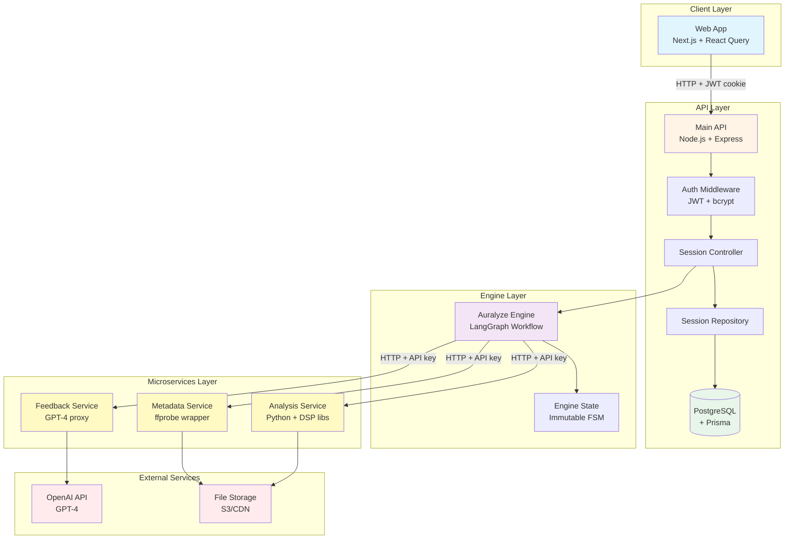

# System Overview

This guide provides a high-level view of the Auralyze platform architecture, showing how all components fit together to deliver AI-powered mix feedback.

## Architecture Diagram



## Component Overview

### Client Layer

**Web Application (Next.js + React Query)**
- Server-side rendered React application
- React Query for data fetching, caching, and synchronization
- JWT-based authentication via HttpOnly cookies
- Handles user interactions, file uploads, and feedback display

**Key Features:**
- Responsive UI for desktop and mobile
- Real-time session status updates
- Audio player with waveform visualization
- User profile and session history

### API Layer

**Main API (Node.js + Express)**
- Central orchestrator for the entire platform
- Handles authentication, authorization, and session management
- Coordinates workflow execution via the Auralyze Engine
- Persists session data to PostgreSQL

**Components:**
- **Auth Middleware:** JWT verification + user lookup
- **Session Controller:** HTTP endpoints for session CRUD
- **Session Repository:** Database abstraction layer (Prisma)
- **HTTP Clients:** Service communication adapters

**Database (PostgreSQL + Prisma):**
- **Users:** Authentication credentials, profile, role
- **Sessions:** Complete engine state as JSON payload
- **Migrations:** Schema versioning and evolution

### Engine Layer

**Auralyze Engine (@auralyze/engine npm package)**
- LangGraph-based workflow orchestration
- Dependency injection for client flexibility
- Immutable state machine (FSM) pattern
- Portable library (used by API, can be used anywhere)

**Workflow Nodes:**
1. **validateInput:** Check session ID, URL format
2. **fetchMetadata:** Call metadata service
3. **analyze:** Call analysis service
4. **generateFeedback:** Call feedback service (LLM)
5. **finalize:** Return complete engine state

**Engine State:**
Immutable object passed between nodes, containing:
- Session metadata (ID, user ID, upload URL)
- File information (duration, format, sample rate)
- Analysis results (loudness, dynamics, spectrum, stereo)
- Feedback (text, suggestions)
- User context (DAW, genre, experience level)

### Microservices Layer

**Metadata Service (Node.js + ffprobe)**
- Extracts technical file metadata
- Uses `ffprobe` (FFmpeg's probe tool)
- Returns duration, format, sample rate, channels, bitrate
- Processing time: 1-3 seconds

**Analysis Service (Python + DSP Libraries)**
- Performs audio signal processing
- **Libraries:** pyloudnorm, librosa, essentia
- **Metrics:** LUFS, true peak, loudness range, crest factor, spectrum, stereo width
- Processing time: 5-30 seconds (scales with file duration)

**Feedback Service (Node.js + OpenAI SDK)**
- Constructs prompts from engine state
- Calls OpenAI GPT-4 API
- Parses and structures feedback responses
- Processing time: 3-10 seconds (OpenAI API latency)

### External Services

**OpenAI API (GPT-4)**
- Large language model for generating feedback
- Receives complete analysis data + user context
- Returns actionable mix suggestions and explanations

**File Storage (S3/CDN)**
- Stores uploaded audio files
- Provides publicly accessible URLs for services
- Handles large file uploads (up to 100MB+)

## Communication Flow

### Star Topology

Auralyze uses a **centralized star topology** where the main API orchestrates all communication:

```
                    Main API
                       │
        ┌──────────────┼──────────────┐
        │              │              │
        ↓              ↓              ↓
    Metadata       Analysis       Feedback
    Service        Service        Service
```

**Characteristics:**
- No service-to-service communication (services are isolated)
- API is the single source of truth and coordination
- Simplifies debugging (all requests flow through one point)
- Easy to add/remove services without affecting others

### Authentication Methods

| Component                     | Auth Method                | Details                                         |
| ----------------------------- | -------------------------- | ----------------------------------------------- |
| **Web → API**                 | JWT (HttpOnly cookie)      | Signed token with user claims, 7-day expiration |
| **API → Microservices**       | API Key (x-api-key header) | Symmetric key, 256-bit random                   |
| **Feedback Service → OpenAI** | API Key (Bearer token)     | OpenAI organization key                         |

## Data Flow

### Session Creation Flow

1. **User uploads audio file** to CDN (presigned URL)
2. **Web app calls** `POST /api/sessions` with file URL + context
3. **API validates JWT** (auth middleware)
4. **Session controller invokes engine** with dependencies
5. **Engine executes workflow:**
   - Fetch metadata from metadata service
   - Analyze audio from analysis service
   - Generate feedback from feedback service
6. **Engine returns complete state**
7. **Repository saves state** to PostgreSQL
8. **API responds** with session data (201 Created)
9. **Web app displays** feedback and suggestions

### Session Retrieval Flow

1. **Web app calls** `GET /api/sessions/:id`
2. **API validates JWT** (auth middleware)
3. **Controller calls repository** to fetch session
4. **Repository queries PostgreSQL** with userId + sessionId (security)
5. **API responds** with session data (200 OK)
6. **Web app displays** saved feedback

## Technology Stack

### Languages & Runtimes
- **TypeScript:** API, engine, microservices (metadata, feedback), web app
- **Python:** Analysis service (DSP libraries)
- **Node.js:** Runtime for API and microservices
- **React:** Web frontend framework

### Frameworks & Libraries
- **Express:** Web framework (API, microservices)
- **Next.js:** React framework with SSR
- **LangGraph:** Workflow orchestration (engine)
- **Prisma:** ORM for PostgreSQL
- **React Query:** Data fetching and caching (web)

### Databases & Storage
- **PostgreSQL:** Relational database (users, sessions)
- **Redis:** (Planned) Job queue, caching, token blacklist
- **S3/CDN:** File storage for uploaded audio

### External APIs
- **OpenAI GPT-4:** Language model for feedback generation
- **FFmpeg/ffprobe:** Multimedia metadata extraction

## Deployment Architecture

### Development (Docker Compose)

```yaml
services:
  api:           # Main API (port 3000)
  metadata:      # Metadata service (port 3001)
  analysis:      # Analysis service (port 3002)
  feedback:      # Feedback service (port 3003)
  web:           # Web app (port 3100)
  postgres:      # Database (port 5432)
```

**Benefits:**
- Single command to start entire stack (`docker-compose up`)
- Service discovery via Docker DNS (service names)
- Isolated networks for security
- Persistent volumes for database

### Production (Planned)

**Container Orchestration:**
- Kubernetes or AWS ECS for container management
- Auto-scaling based on load
- Rolling updates for zero-downtime deployments

**Database:**
- Managed PostgreSQL (AWS RDS, Google Cloud SQL)
- Automatic backups and point-in-time recovery
- Read replicas for scaling queries

**Load Balancing:**
- Application Load Balancer (ALB) for HTTPS termination
- Distribute traffic across multiple API instances
- Health checks for automatic failover

**Caching & Queues:**
- Redis cluster for caching and job queues
- ElastiCache for managed Redis
- Background workers for async job processing

## Security Model

### Defense in Depth

**Layer 1: Network**
- HTTPS/TLS for all external communication
- Private VPC for service-to-service communication
- Security groups restrict access (firewall rules)

**Layer 2: Authentication**
- JWT with HMAC signature (prevents tampering)
- bcrypt password hashing (slow, resistant to brute force)
- API keys for service-to-service auth

**Layer 3: Authorization**
- User role enforcement (USER vs ADMIN)
- Session ownership checks (userId must match)
- Soft deletes (isActive flag) honored in auth

**Layer 4: Application**
- Input validation (Zod schemas)
- SQL injection prevention (Prisma parameterized queries)
- XSS prevention (HttpOnly cookies)
- CSRF prevention (SameSite cookies)

## Scalability Considerations

### Current Bottlenecks

1. **Synchronous Workflow:** 10-60 second requests block HTTP threads
2. **Analysis Service:** CPU-intensive DSP (single-threaded Python)
3. **Database Pagination:** Offset-based (O(n) for large offsets)
4. **No Caching:** Every request re-processes audio

### Scaling Strategies

**Horizontal Scaling:**
- Run multiple instances of API and microservices
- Load balancer distributes traffic
- Stateless services (no shared memory)

**Async Processing:**
- Move workflow to background jobs (Redis queue)
- API returns immediately (202 Accepted)
- Clients poll for results or use WebSockets

**Caching:**
- Cache analysis results by file hash (Redis)
- Cache metadata by URL (1 hour TTL)
- Cache user sessions in API memory (reduce DB queries)

**Database Optimization:**
- Cursor-based pagination (O(log n) lookups)
- Read replicas for query scaling
- Connection pooling (PgBouncer)

## Observability

### Logging (Planned)

- Structured JSON logs (Winston, Pino)
- Request ID propagation across services
- Log aggregation (ELK stack, Datadog)
- Error tracking (Sentry)

### Metrics (Planned)

- Request latency histograms (p50, p95, p99)
- Service availability (uptime %)
- Workflow success rate
- Database query performance

### Tracing (Planned)

- Distributed tracing (OpenTelemetry, Jaeger)
- Trace requests across all services
- Identify bottlenecks in workflow

## Further Reading

- [Session Lifecycle](./session-lifecycle.md) - End-to-end session flow
- [Design Decisions](./design-decisions.md) - Architectural rationale
- [LangGraph Workflow](../langgraph.md) - Engine implementation
- [Microservices Overview](../microservices-overview.md) - Service details
