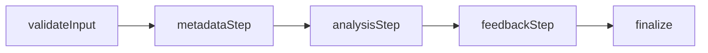

# LangGraph Workflow

The entire engine runtime is defined in `src/graph/mixtapelabs-graph.ts`. The graph contains five nodes executed sequentially:

1. `validateInput`
2. `metadataStep`
3. `analysisStep`
4. `feedbackStep`
5. `finalize`



## Node-by-node behavior

| Node            | Purpose                                       | Short-circuit behavior                                 |
| --------------- | --------------------------------------------- | ------------------------------------------------------ |
| `validateInput` | Ensures `uploadUrl` exists.                   | Sets `error` and terminates.                           |
| `metadataStep`  | Calls `audioMetadataClient.getMetadata`.      | Stores `fileInfo` or sets `error`.                     |
| `analysisStep`  | Calls `audioAnalysisClient.analyze`.          | Stores `analysis` or sets `error`.                     |
| `feedbackStep`  | Calls `feedbackClient.generateFeedback`.      | Stores `feedbackText` + `suggestions` or sets `error`. |
| `finalize`      | Reserved for derived fields or normalization. | Always runs; currently passthrough.                    |

Each node receives the entire `EngineState` and returns a partial state. LangGraph merges the result into the canonical state object.

## Error propagation

- If any node throws, a human-readable `error` string is created via `formatError('<Node>', err)`.
- Downstream nodes check `state.error` and simply return `{}` to avoid additional work.
- Integration tests ensure metadata and analysis errors halt later nodes.

## Extending the graph

```ts
workflow.addNode('transientScan', async (state) => {
  if (state.error || !state.uploadUrl) return {};
  const report = await deps.transientClient.scan({ url: state.uploadUrl });
  return { analysis: { ...state.analysis, transients: report } };
});

workflow.addEdge('analysisStep', 'transientScan');
workflow.addEdge('transientScan', 'feedbackStep');
```

Remember to update `GRAPH_NODE_NAMES` so TypeScript understands the new node ID, and expand the test suite to cover success and failure paths.
