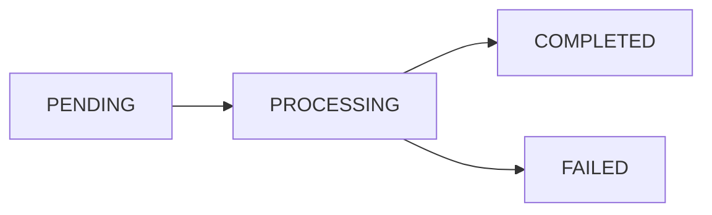

# Production Deployment Guide

This guide covers production deployment considerations, timeout handling, and async job processing for Mixtape.

## Overview

Mixtape's architecture requires careful handling of long-running audio processing tasks, especially when deployed to platforms with HTTP timeout limits like Railway, Heroku, or Vercel.

## Platform Constraints

### Railway (Current Deployment)

**HTTP Timeout:** 30 seconds

- All HTTP requests must complete within 30 seconds
- Exceeding this returns 502 Bad Gateway
- No configuration option to increase

**Implications:**

- Large files (>15 MB) may timeout during download
- Long audio files (>5 minutes) may timeout during analysis
- Slow CDNs can cause timeout even for small files

### FFmpeg/FFprobe Requirements

::: tip Bundled Binaries
Both services use `-static` packages that **bundle the FFmpeg/ffprobe binaries**:


- `audio-metadata-service`: Uses `ffprobe-static` (includes ffprobe binary)
- `audio-analysis-service`: Uses `ffmpeg-static` (includes FFmpeg binary)

**No system FFmpeg installation required!** The binaries are included in the npm packages.
:::

**Deployment:**

Services work out of the box in any environment. Dockerfiles are provided for Railway deployment but **do not install system FFmpeg** - the bundled binaries are sufficient.

**Railway Deployment (Standalone Repos):**

Each service deploys from its own repository. Railway automatically detects the Dockerfile and builds the TypeScript code.

```dockerfile
# Both services use this simplified pattern:
FROM node:22-slim
WORKDIR /app
COPY package*.json ./
RUN npm ci  # Installs ffmpeg-static or ffprobe-static
COPY . .
RUN npm run build
RUN npm prune --production
CMD ["node", "dist/index.js"]
```

**Key Points:**

- Services use bundled FFmpeg/ffprobe binaries (no system install needed)
- TypeScript builds from source in Docker
- Each service is a separate Railway project
- Services communicate via Railway internal networking (`*.railway.internal`)

### Other Platforms

| Platform         | HTTP Timeout           | Workaround                   |
| ---------------- | ---------------------- | ---------------------------- |
| Railway          | 30s                    | Async jobs required          |
| Heroku           | 30s                    | Background workers           |
| Vercel           | 10s (Hobby), 60s (Pro) | Serverless functions + queue |
| AWS Lambda       | 15 minutes (max)       | Step Functions               |
| Google Cloud Run | 60 minutes (max)       | Best for long tasks          |

## Railway Deployment (Standalone Repos)

Mixtape deploys as **separate Railway projects** (not a monorepo). Each service runs in its own project with independent deployment:

### Architecture

```
┌─────────────────────────────────────────┐
│  PostgreSQL Database                    │
│  (Railway managed)                      │
└─────────────────────────────────────────┘
           ↑
           │ DATABASE_URL reference
           │
┌─────────────────────────────────────────┐
│  API Service                            │
│  - Connects to DB                       │
│  - Calls audio services via internal    │
│    networking (.railway.internal)       │
└─────────────────────────────────────────┘
           ↑
           │ Public URL
           │
┌─────────────────────────────────────────┐
│  Web Frontend (Next.js)                 │
│  - Calls API via public URL             │
└─────────────────────────────────────────┘

Separate Projects:
┌───────────────────────────────┐
│ Audio Metadata Service        │
│ - Dockerfile with FFmpeg      │
│ - Internal URL only           │
└───────────────────────────────┘

┌───────────────────────────────┐
│ Audio Analysis Service        │
│ - Dockerfile with FFmpeg      │
│ - Internal URL only           │
└───────────────────────────────┘
```

### Quick Start

**1. Deploy Services (in order):**

```bash
# Each from its own repository
1. Database    → Create PostgreSQL in Railway
2. Metadata    → Deploy with Dockerfile (ffprobe-static bundled)
3. Analysis    → Deploy with Dockerfile (ffmpeg-static bundled)
4. API         → Deploy with Dockerfile (Prisma generation)
5. Web         → Deploy with API URL
```

**2. Environment Variables:**

```bash
# Metadata Service
AUDIO_METADATA_API_KEY=<generate-locally>

# Analysis Service
AUDIO_ANALYSIS_API_KEY=<generate-locally>

# API Service
NPM_TOKEN=<your-npm-registry-token>  # Required for @mixtapelabs/engine
DATABASE_URL=${{Postgres.DATABASE_URL}}
CORS_ORIGIN=https://your-web-app.up.railway.app  # Optional: Explicit origin for CORS
METADATA_SERVICE_URL=https://metadata-service.railway.internal
ANALYSIS_SERVICE_URL=https://analysis-service.railway.internal
METADATA_SERVICE_API_KEY=<from-metadata-service>
ANALYSIS_SERVICE_API_KEY=<from-analysis-service>
FEEDBACK_MODE=openai
OPENAI_API_KEY=<your-key>
JWT_SECRET=<strong-random-string>

# Web Service
NEXT_PUBLIC_API_URL=https://your-api.up.railway.app
```

::: tip CORS Configuration
By default, the API reflects the request origin (allows all origins with credentials). For production, it's recommended to set `CORS_ORIGIN` to your web app's URL for better security. You can specify multiple origins separated by commas: `https://app1.com,https://app2.com`
:::

**3. Generate API Keys Locally:**

```bash
# In each service repo
npm run generate:api-key
# Copy output to Railway environment variables
```

::: tip Railway Internal Networking
Services communicate via `*.railway.internal` domains for better performance and security. Add service references in Railway dashboard to enable internal networking.
:::

::: warning Critical: NPM Token Required (API Service)
The API service depends on the private `@mixtapelabs/engine` package hosted on **GitHub Packages**. You **must** set the `NPM_TOKEN` environment variable in Railway with a GitHub Personal Access Token that has `read:packages` scope. Without this, Docker build will fail when trying to `npm ci`.

Generate token: GitHub Settings → Developer settings → Personal access tokens → Generate new token (classic) → Select `read:packages` scope → Copy to Railway env vars
:::

::: warning Critical: Dockerfile Required
All services **must use Docker builds** (not Nixpacks) to ensure:

- **API Service**: Prisma Client is generated before runtime
- **Audio Services**: ffmpeg-static/ffprobe-static binaries are properly bundled

Railway will auto-detect Dockerfiles. If you see `Error: @prisma/client did not initialize` or `Error: spawn ffprobe ENOENT`, verify your Dockerfile exists and follows the examples in each service README.
:::

### Verification

After deployment, check service health:

```bash
curl https://your-metadata-service.up.railway.app/health
curl https://your-analysis-service.up.railway.app/health
curl https://your-api-service.up.railway.app/health
```

All should return `200 OK`.

::: tip Additional Resources
For detailed step-by-step Railway setup instructions and troubleshooting, see `RAILWAY_SETUP.md` and `RAILWAY_DEPLOYMENT.md` in the project root directory.
:::

## Solution: Dual Processing Modes

### Synchronous Mode (Small Files)

**Use When:**

- File size < 15 MB
- Audio duration < 5 minutes
- Development/testing
- Files on fast CDN

**Flow:**

```
Client → POST /api/sessions (async=false)
         ↓
         [Processing: 10-60s]
         ↓
         ← 201 COMPLETED {analysis, feedback}
```

**Characteristics:**

- Simple request/response
- User waits for results
- Works within 30s Railway timeout
- Best user experience (immediate results)

### Asynchronous Mode (Large Files)

**Use When:**

- File size > 15 MB
- Audio duration > 5 minutes
- Slow CDN or high latency
- Production reliability required

**Flow:**

```
Client → POST /api/sessions (async=true)
         ← 202 PENDING {sessionId, status}

[Background Processing]
PENDING → PROCESSING → COMPLETED/FAILED

Client → GET /api/sessions/:id (poll every 2s)
         ← 200 {status: "PROCESSING"}

Client → GET /api/sessions/:id
         ← 200 {status: "COMPLETED", analysis, feedback}
```

**Characteristics:**

- Immediate response (no waiting)
- Background processing
- Poll for status updates
- No timeout risk
- Handles files of any size

## Implementation

### Session Status Lifecycle



**Status Definitions:**

- `PENDING`: Queued, not yet started
- `PROCESSING`: Currently being analyzed
- `COMPLETED`: Analysis finished successfully
- `FAILED`: Analysis failed with error

### API Request Format

```typescript
// POST /api/sessions
{
  "sessionId": "uuid-123",
  "uploadUrl": "https://cdn.example.com/audio.wav",
  "userContext": {
    "daw": "Ableton",
    "genre": "Electronic",
    "experienceLevel": "intermediate"
  },
  "async": true  // Enable async processing
}
```

### API Response Formats

**Async Mode (202 Accepted):**

```json
{
  "sessionId": "uuid-123",
  "status": "PENDING",
  "message": "Session queued for processing. Poll GET /api/sessions/:id to check status."
}
```

**Polling Response (Processing):**

```json
{
  "sessionId": "uuid-123",
  "status": "PROCESSING",
  "createdAt": "2025-11-19T10:30:00Z",
  "fileInfo": {
    "durationSec": 180,
    "format": "mp3"
  }
}
```

**Polling Response (Completed):**

```json
{
  "sessionId": "uuid-123",
  "status": "COMPLETED",
  "fileInfo": { ... },
  "analysis": {
    "loudness": { ... },
    "dynamics": { ... },
    "spectrum": { ... },
    "stereo": { ... }
  },
  "feedbackText": "Your mix shows excellent...",
  "suggestions": ["Consider...", "Try..."]
}
```

**Polling Response (Failed):**

```json
{
  "sessionId": "uuid-123",
  "status": "FAILED",
  "error": "Metadata failed: ffprobe timeout after 25000ms - file may be too large or download too slow"
}
```

## Timeout Protection

### Service-Level Timeouts

All microservices implement 25-second timeouts to fail gracefully before Railway's 30s limit:

#### Metadata Service

```typescript
// audio-metadata-service/src/services/audio-metadata-service.ts
const timeoutMs = 25000;
const ffprobePromise = this.runFfprobe(filePath, { path: binaryPath });
const timeoutPromise = new Promise<never>((_, reject) =>
  setTimeout(
    () => reject(new Error(`ffprobe timeout after ${timeoutMs}ms`)),
    timeoutMs
  )
);

info = await Promise.race([ffprobePromise, timeoutPromise]);
```

**Error Response:**

```json
{
  "error": "Failed to read metadata",
  "details": "ffprobe timeout after 25000ms - file may be too large or download too slow"
}
```

#### Analysis Service

```typescript
// audio-analysis-service/src/services/audio-analysis-service.ts
const timeoutMs = 25000;
const timeoutId = setTimeout(() => {
  command.kill('SIGKILL');
  reject(new Error(`FFmpeg ${analyzer} timeout after ${timeoutMs}ms`));
}, timeoutMs);

command
  .on('end', () => {
    clearTimeout(timeoutId);
    resolve(stderrLines.join('\n'));
  })
  .on('error', (err) => {
    clearTimeout(timeoutId);
    reject(err);
  })
  .run();
```

**Benefits:**

- Clear error messages instead of generic 502
- Clean process termination (SIGKILL for FFmpeg)
- Services fail fast (25s) before Railway kills them (30s)

## Client Implementation

### Frontend Polling

**React Hook with Auto-Polling:**

```typescript
import { useSession } from '@/hooks/useSessions';

function SessionPage({ sessionId }: { sessionId: string }) {
  const { data: session } = useSession(sessionId, {
    refetchInterval: (query) => {
      const status = query.state.data?.status;
      // Stop polling when done
      if (status === 'COMPLETED' || status === 'FAILED') {
        return false;
      }
      // Poll every 2 seconds while processing
      return 2000;
    }
  });

  if (session?.status === 'PENDING' || session?.status === 'PROCESSING') {
    return <ProgressIndicator status={session.status} />;
  }

  if (session?.status === 'FAILED') {
    return <ErrorBanner message={session.error} />;
  }

  return <AnalysisResults session={session} />;
}
```

**Manual Polling:**

```typescript
import { pollSessionUntilComplete } from '@/lib/api/sessions';

async function createAndWaitForSession() {
  // Create session in async mode
  const pending = await createSession({
    sessionId: sessionId,
    uploadUrl: largeFileUrl,
    async: true
  });

  console.log('Session queued:', pending.status); // "PENDING"

  // Poll until complete
  const final = await pollSessionUntilComplete(
    sessionId,
    (state) => {
      console.log('Current status:', state.status);
      // Update UI with progress
    }
  );

  console.log('Analysis complete!', final.analysis);
}
```

## File Size Recommendations

### Optimal Ranges

| File Size | Duration  | Mode  | Expected Time | Success Rate |
| --------- | --------- | ----- | ------------- | ------------ |
| < 5 MB    | < 2 min   | Sync  | 5-15s         | 99%          |
| 5-15 MB   | 2-5 min   | Sync  | 15-30s        | 95%          |
| 15-30 MB  | 5-10 min  | Async | 30-60s        | 99%          |
| 30-50 MB  | 10-15 min | Async | 60-90s        | 99%          |
| > 50 MB   | > 15 min  | Async | 90-180s       | 95%          |

### Auto-Detection Strategy

```typescript
async function selectProcessingMode(uploadUrl: string): Promise<boolean> {
  try {
    // Try HEAD request to get file size
    const response = await fetch(uploadUrl, { method: 'HEAD' });
    const contentLength = response.headers.get('content-length');

    if (contentLength) {
      const fileSizeBytes = parseInt(contentLength, 10);
      const threshold = 15 * 1024 * 1024; // 15 MB
      return fileSizeBytes > threshold; // true = async, false = sync
    }
  } catch (error) {
    console.warn('Could not determine file size, using sync mode');
  }

  // Default to sync mode
  return false;
}

// Usage
const async = await selectProcessingMode(uploadUrl);
await createSession({ sessionId, uploadUrl, async });
```

## Monitoring

### Key Metrics

**Session Status Distribution:**

```sql
SELECT status, COUNT(*) as count
FROM sessions
GROUP BY status;
```

**Average Processing Time:**

```sql
SELECT
  AVG(EXTRACT(EPOCH FROM (updatedAt - createdAt))) as avg_seconds
FROM sessions
WHERE status = 'COMPLETED';
```

**Failure Rate:**

```sql
SELECT
  COUNT(CASE WHEN status = 'FAILED' THEN 1 END) * 100.0 / COUNT(*) as failure_rate
FROM sessions
WHERE createdAt > NOW() - INTERVAL '24 hours';
```

### Railway Logs

**Successful Processing:**

```
Creating session: 8dc575b8-8f14-4dee-816a-41f26e7fa6ec
Calling metadata service at https://audio-metadata-service-production.up.railway.app
Metadata extracted in 2.3s
Calling analysis service at https://audio-analysis-service-production.up.railway.app
Analysis complete in 15.8s
Calling feedback service at https://feedback-service-production.up.railway.app
Feedback generated in 4.2s
Session complete: COMPLETED
```

**Timeout (Before Fix):**

```
Application failed to respond
[Railway terminates process with 502]
```

**Timeout (After Fix - Clear Error):**

```
Failed to read metadata Error: ffprobe timeout after 25000ms - file may be too large or download too slow
Session complete: FAILED
```

## Best Practices

### 1. Always Set Timeouts

```typescript
// ✅ Good: Explicit timeout
const result = await Promise.race([
  processFile(url),
  timeout(25000, 'Processing timeout')
]);

// ❌ Bad: No timeout
const result = await processFile(url);
```

### 2. Use Async for Production

```typescript
// ✅ Good: Async for reliability
await createSession({
  sessionId,
  uploadUrl,
  async: true  // Always async in production
});

// ⚠️ Acceptable: Sync for small known files
await createSession({
  sessionId,
  uploadUrl: shortSample,
  async: false
});
```

### 3. Implement Retry Logic

```typescript
async function createSessionWithRetry(payload: CreateSessionPayload, maxRetries = 3) {
  for (let attempt = 0; attempt < maxRetries; attempt++) {
    try {
      return await createSession(payload);
    } catch (error) {
      if (attempt === maxRetries - 1) throw error;

      // Exponential backoff
      await sleep(Math.pow(2, attempt) * 1000);
    }
  }
}
```

### 4. Handle All Status States

```typescript
function SessionView({ session }: { session: EngineState }) {
  switch (session.status) {
    case 'PENDING':
      return <div>⏳ Queued for processing...</div>;

    case 'PROCESSING':
      return <div>⚙️ Analyzing audio...</div>;

    case 'COMPLETED':
      return <AnalysisResults data={session} />;

    case 'FAILED':
      return <ErrorMessage error={session.error} />;

    default:
      return <div>Unknown status</div>;
  }
}
```

## Future Improvements

### 1. Job Queue (BullMQ + Redis)

Replace in-memory background jobs with persistent queue:

```typescript
import Queue from 'bull';

const sessionQueue = new Queue('sessions', {
  redis: { host: 'redis', port: 6379 }
});

// Producer
await sessionQueue.add('analyze', {
  sessionId,
  uploadUrl,
  userId
}, {
  attempts: 3,
  backoff: { type: 'exponential', delay: 2000 }
});

// Consumer
sessionQueue.process('analyze', async (job) => {
  const { sessionId, uploadUrl, userId } = job.data;

  job.progress(0);
  await extractMetadata(uploadUrl);

  job.progress(33);
  await analyzeAudio(uploadUrl);

  job.progress(66);
  await generateFeedback();

  job.progress(100);
});
```

**Benefits:**

- Survives server restarts
- Built-in retry logic
- Job prioritization
- Worker scaling
- Progress tracking

### 2. WebSocket Updates

Replace polling with real-time push notifications:

```typescript
// Server
io.on('connection', (socket) => {
  socket.on('subscribe', (sessionId) => {
    socket.join(`session:${sessionId}`);
  });
});

// Emit when status changes
io.to(`session:${sessionId}`).emit('status', {
  sessionId,
  status: 'PROCESSING',
  progress: 33
});

// Client
socket.on('status', (data) => {
  updateSession(data);
});
```

**Benefits:**

- No polling overhead
- Lower latency
- Better UX
- Reduced API calls

### 3. Streaming Analysis

Process file in chunks instead of downloading entire file:

```typescript
async function* streamingAnalysis(url: string) {
  const stream = await fetch(url).then(r => r.body);

  for await (const chunk of stream) {
    yield analyzeChunk(chunk);
  }
}

// Usage
for await (const partial of streamingAnalysis(url)) {
  updateProgress(partial);
}
```

**Benefits:**

- Start processing before full download
- Lower memory usage
- Faster time-to-first-result

## Troubleshooting

### Session Stuck in PENDING

**Symptom:** Status never changes from PENDING

**Causes:**

1. Background job crashed without updating status
2. Service restart during processing
3. Exception not caught

**Fix:**

```sql
-- Find stuck sessions (pending > 5 minutes)
SELECT sessionId, createdAt
FROM sessions
WHERE status = 'PENDING'
  AND createdAt < NOW() - INTERVAL '5 minutes';

-- Mark as failed
UPDATE sessions
SET status = 'FAILED',
    error = 'Processing timeout - job did not complete'
WHERE sessionId IN (...);
```

### Session Stuck in PROCESSING

**Symptom:** Status never reaches COMPLETED/FAILED

**Causes:**

1. Service crashed during analysis
2. Infinite loop in processing
3. Deadlock

**Fix:**

```sql
-- Find stuck sessions (processing > 10 minutes)
SELECT sessionId, updatedAt
FROM sessions
WHERE status = 'PROCESSING'
  AND updatedAt < NOW() - INTERVAL '10 minutes';

-- Mark as failed
UPDATE sessions
SET status = 'FAILED',
    error = 'Processing timeout - analysis did not complete'
WHERE sessionId IN (...);
```

### High Failure Rate

**Symptom:** Many sessions with status=FAILED

**Investigation:**

```sql
-- Group failures by error message
SELECT
  SUBSTRING(error, 1, 100) as error_prefix,
  COUNT(*) as count
FROM sessions
WHERE status = 'FAILED'
  AND createdAt > NOW() - INTERVAL '24 hours'
GROUP BY error_prefix
ORDER BY count DESC;
```

**Common Errors:**

- `ffprobe timeout`: Files too large or CDN too slow
- `OPENAI_API_KEY is required`: Missing configuration
- `401 Unauthorized`: API key mismatch between services
- `Service unavailable`: Microservice down

## Summary

✅ **Dual Processing Modes**: Sync for small files, async for large files
✅ **Timeout Protection**: 25s timeouts prevent Railway 502 errors
✅ **Status Tracking**: PENDING → PROCESSING → COMPLETED/FAILED
✅ **Client Polling**: Auto-refresh until completion
✅ **Clear Error Messages**: Descriptive failures instead of generic 502
✅ **Production Ready**: Handles files of any size reliably

**Next Steps:**

1. Monitor session status distribution
2. Adjust file size threshold based on metrics
3. Consider job queue for higher reliability
4. Implement WebSocket for better UX
