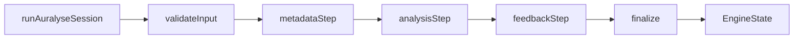

# Auralyse Engine Documentation

Welcome to the official docs for `@auralyse/engine`, the LangGraph-powered workflow engine that drives mix and mastering insights for Auralyse. The engine orchestrates session validation, metadata enrichment, DSP analysis, and LLM-driven feedback without binding you to any HTTP server or infrastructure stack.

## Why this engine exists

- **Consistent session state** – normalized Zod schemas keep metadata, analysis blocks, and user context stable across services.
- **Composable LangGraph nodes** – validation, metadata, analysis, feedback, and finalize steps are explicitly modeled and easy to extend.
- **Dependency injection first** – hosts provide the concrete audio metadata, DSP, and feedback clients; the engine never talks to ffmpeg or OpenAI directly on its own.
- **Portable Node library** – publishable package with strict TypeScript types, vitest coverage, ESLint, and tsup builds for ESM + CJS.

## Fast links

- [Getting Started](./guide/getting-started.md)
- [Session State & Schemas](./guide/session-state.md)
- [LangGraph workflow](./guide/langgraph.md)
- [Prompting and Feedback](./guide/prompting.md)
- [Testing strategy](./guide/testing.md)
- [Release & CI/CD](./guide/releasing.md)

## At a glance

1. Call `runAuralyseSession(input, deps)` from your API tier.
2. LangGraph executes the five nodes in sequence, short-circuiting when errors occur.
3. The resulting `EngineState` includes metadata, analysis results, and LLM insight text/suggestions or an error message your API can relay to clients.

Dive into the guide for detailed instructions, architectural rationale, and CI/CD practices.
