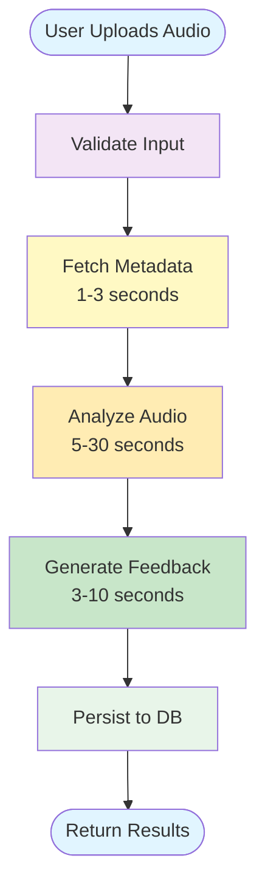

# Mixtapelabs Documentation

Welcome to the comprehensive documentation for Mixtapelabs, an AI-powered audio analysis platform that provides intelligent mix feedback to music producers.

## Platform Overview

Mixtapelabs combines audio engineering expertise with large language models to deliver actionable feedback on audio mixes. The platform consists of:

- **Engine** – LangGraph-powered workflow orchestration (`@mixtapelabs/engine`)
- **Main API** – Authentication, session management, workflow coordination
- **Microservices** – Metadata extraction, DSP analysis, AI feedback generation
- **Web App** – React-based user interface

## Documentation Sections

### 🚀 Getting Started

New to Mixtapelabs? Start here.

- [Getting Started](./guide/getting-started.md) - Installation and first workflow
- [Reading Path](./guide/onboarding/reading-path.md) - Recommended learning path for new engineers
- [Dev Playground](./guide/dev-playground.md) - Experiment with the engine
- [Contributing](./guide/onboarding/contributing.md) - Code standards and review process

### 📚 Domain Knowledge

Core technical concepts across audio, security, and data.

- [Audio Fundamentals](./guide/domain/audio-fundamentals.md) - LUFS, dynamics, spectrum, stereo imaging
- [Security Model](./guide/domain/security-model.md) - JWT, bcrypt, API keys, threat model
- [Database Patterns](./guide/domain/database-patterns.md) - Prisma ORM, indexing, queries
- [Communication Patterns](./guide/domain/communication-patterns.md) - HTTP clients, error handling

### 🏗️ System Architecture

High-level design and architectural decisions.

- [System Overview](./guide/architecture/system-overview.md) - Component diagram and data flow
- [Session Lifecycle](./guide/architecture/session-lifecycle.md) - End-to-end session flow
- [Design Decisions](./guide/architecture/design-decisions.md) - Architectural rationale and trade-offs

### ⚙️ Engine Architecture

Workflow orchestration and dependency injection.

- [Session State & Schemas](./guide/session-state.md) - Immutable state management
- [LangGraph Workflow](./guide/langgraph.md) - Graph-based orchestration
- [Dependency Injection & Clients](./guide/clients.md) - Interface abstraction
- [Prompting & Feedback](./guide/prompting.md) - LLM integration

### 🔌 Platform Services

Microservices that power the platform.

- [Microservices Overview](./guide/microservices-overview.md) - Service landscape
- [Audio Metadata Service](./guide/audio-metadata-service.md) - ffprobe wrapper (1-3s)
- [Audio Analysis Service](./guide/audio-analysis-service.md) - DSP processing (5-30s)
- [Audio Feedback Service](./guide/audio-feedback-service.md) - LLM integration (3-10s)

### 📊 Performance & Operations

Performance characteristics, deployment, and known issues.

- [Performance Characteristics](./guide/operations/performance-characteristics.md) - Timing, bottlenecks, optimization
- [Production Deployment](./guide/operations/production-deployment.md) - Railway setup, timeout handling, async jobs
- [Technical Debt](./guide/operations/technical-debt.md) - Known issues and future work

### 🛠️ API & Development

API reference and development practices.

- [API Reference](./guide/api-reference.md) - Endpoints and request/response formats
- [Testing Strategy](./guide/testing.md) - Unit and integration testing
- [AI Collaboration Guidelines](./guide/ai-guidelines.md) - Working with AI assistants
- [Releasing & CI/CD](./guide/releasing.md) - Deployment and versioning

## Quick Start

Get the engine running in under 5 minutes:

```bash
# Clone the repository
git clone https://github.com/mixtapelabs/engine.git
cd engine

# Install dependencies
npm install

# Run tests
npm test

# Build the package
npm run build
```

**Use in your project:**

```typescript
import { runMixtapelabsSession } from '@mixtapelabs/engine';

const deps = {
  audioMetadataClient: { /* implementation */ },
  audioAnalysisClient: { /* implementation */ },
  feedbackClient: { /* implementation */ }
};

const engineState = await runMixtapelabsSession({
  sessionId: 'uuid',
  uploadUrl: 'https://cdn.example.com/mix.wav',
  userContext: { daw: 'Ableton', genre: 'trap', experienceLevel: 'intermediate' }
}, deps);

console.log(engineState.feedback); // AI-generated mix feedback
```

## Workflow Visualization



**Total Duration:** 10-60 seconds (sequential execution)

## Key Features

✅ **Consistent State Management** – Zod schemas ensure type safety across services
✅ **Composable Workflow** – LangGraph nodes are modular and extensible
✅ **Dependency Injection** – Swap clients for testing (stubs) or production (HTTP)
✅ **Portable Library** – Use in API, CLI, batch jobs, or anywhere Node.js runs
✅ **Production Ready** – TypeScript, Vitest, ESLint, comprehensive test coverage

## Technical Stack

- **Languages:** TypeScript (API/Engine), Python (Analysis Service)
- **Frameworks:** Express, Next.js, LangGraph
- **Database:** PostgreSQL + Prisma ORM
- **Audio:** ffprobe, librosa, pyloudnorm, essentia
- **AI:** OpenAI GPT-4
- **Infrastructure:** Docker, Docker Compose

## Need Help?

- 📖 **Documentation:** You're here! Explore the sidebar for detailed guides
- 💬 **Community:** Join discussions on GitHub Issues
- 🐛 **Bug Reports:** [Create an issue](https://github.com/mixtapelabs/engine/issues)
- 📧 **Contact:** engineering@mixtapelabs.com

## What's Next?

- **New Engineers:** Start with [Reading Path](./guide/onboarding/reading-path.md)
- **Understand Audio:** Read [Audio Fundamentals](./guide/domain/audio-fundamentals.md)
- **Dive into Code:** Explore [System Architecture](./guide/architecture/system-overview.md)
- **Optimize Performance:** Check [Technical Debt](./guide/operations/technical-debt.md) for improvement opportunities

---

**Documentation Version:** 2.0
**Last Updated:** November 18, 2025
**Engine Version:** 1.0.0

